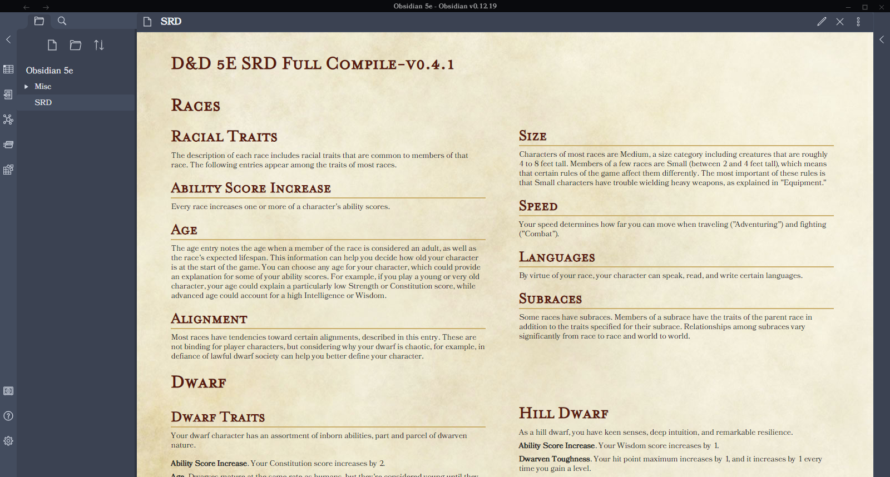

# Obsidian 5e

A theme for Obsidian based on NaturalCrit's Homebrewery themes.

## Installation

1. Download obsidian-5e.css to your Obsidian vault folder
2. In Obsidian, click Settings -> Plugins make sure `Custom CSS` is enabled
3. Pick either light or dark theme in Obsidian's appearance settings!